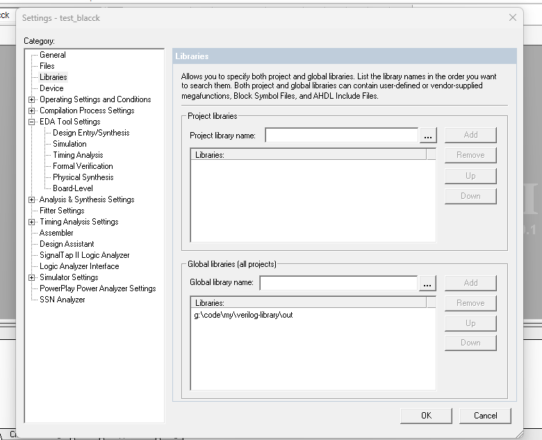

# verilog-library

A very simple Verilog library, including Verilog and Symbol

## ✨Features

- Adder
  - Full Adder
  - Half Adder
- Flip Flop
  - RS Flip Flop

## ⚡Usage

### Quartus II

Click `Assignments > Settings > Library` and enter the path to install the lib in `Global library name` or `Project library name`

