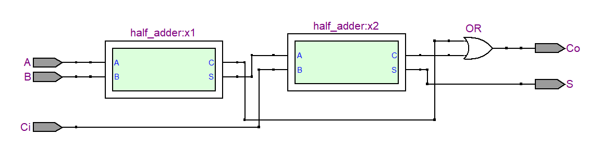
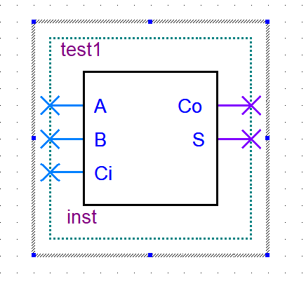
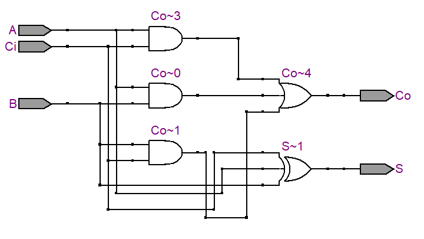
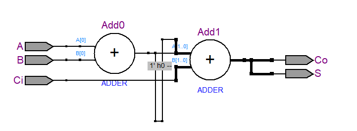

### Full Adder

```v
full_adder(input A, B, Ci, output Co, S)
```




### Other logic full adder

```v
module s_full_adder(input A, B, Ci, output Co, S);
  assign S = A ^ B ^ Ci;
  assign Co = (A & B) | ((A ^ B) & Ci);
endmodule
```



> Verilog special syntax

```v
module v_full_adder(input A, B, Ci, output Co, S);
  assign {Co, S} = A + B + Ci;
endmodule
```


