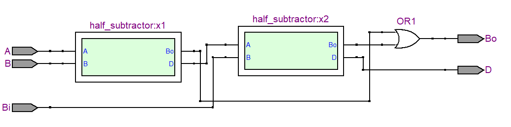
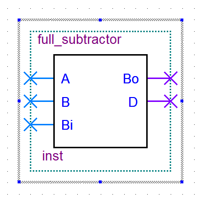

### Full Subtractor

```v
full_subtractor(input A, B, Bi, output Bo, D);
```




#### Other implementations

```v
module s_full_subtractor(input A, B, Bi, output D, Bo);
  assign D = A ^ B ^ Bi;
  assign Bo = (~A & B) | (~(A ^ B) & Bi);
endmodule
```

<!--  -->

```v
module v_full_subtractor(input A, B, Bi, output D, Bo);
  assign {Bo, D} = A - B - Bi;
endmodule
```

<!--  -->
